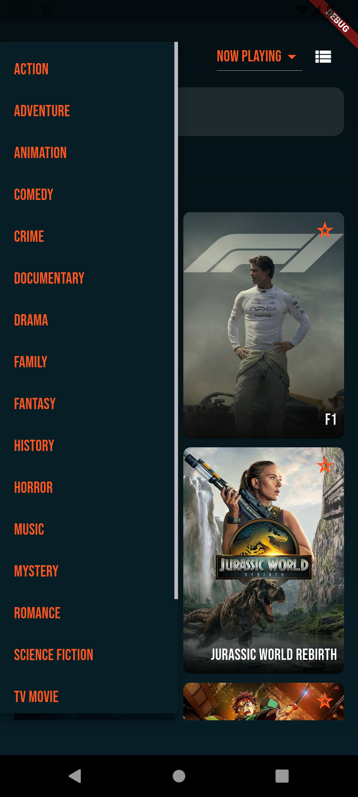
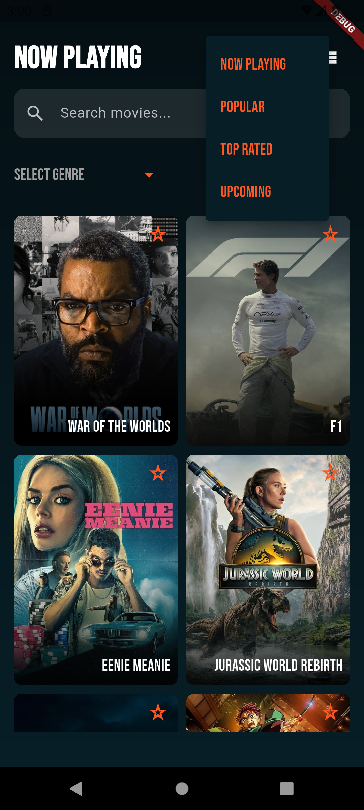
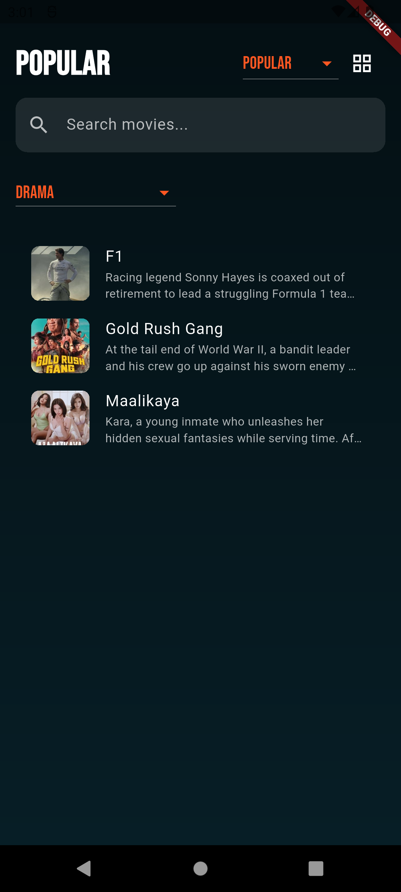

# 🎥 Movie App - TMDB APIs

A beautiful and responsive **Movie Application** UI clone made using **Flutter**, mimicking the real-world streaming app experience.

This project is focused entirely on **frontend UI/UX**, **clean architecture**, **API calling structure** , aiming to replicate the original app’s look and feel using Flutter best practices.

 

## 🚀 Features

- ✅ Home Screen
- ✅ Movie view in Grid and List format
- ✅ Responsive design using `Sizer` for all screen sizes
- ✅ Filter Selection dropdowns
- ✅ Movie Details Screen with all relevant information
- ✅ Reusable widgets and clean code structure

 

## 📱 Screenshots

<h3 align="left">📸 App Screenshots</h3>

  
  
  

  
   

 

<h4> Don't forget to give ⭐ if you find this helpful </h4>

<h4> Till then, Keep Fluttering 💙</h4>